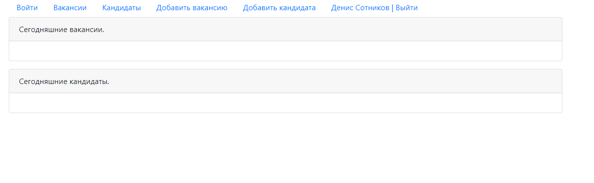
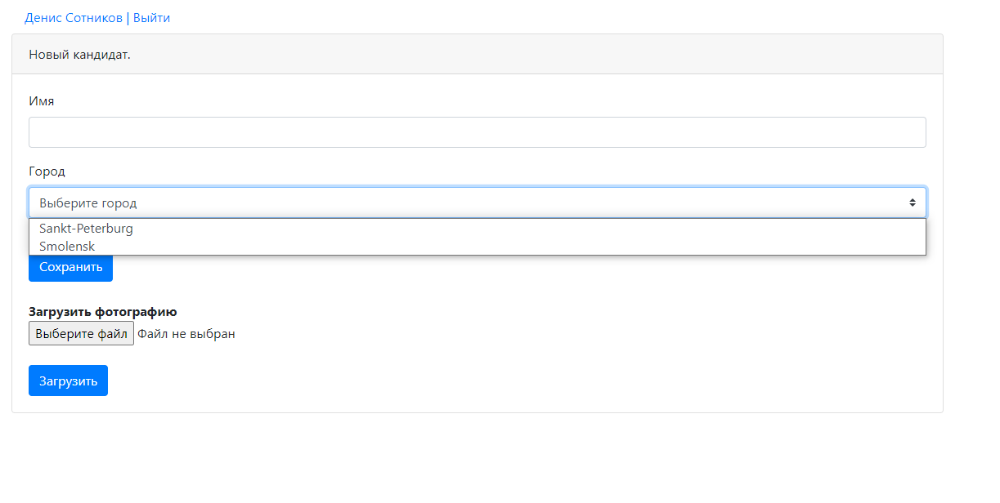

Technologies:
Servlets
JSP
Simple HTML/JS(JQueue|Ajax)/CSS
JDBC
Apache Tomcat
OOP
This application demonstrates a simple job placement and resume service for job search and candidate search

Interface in my Application

