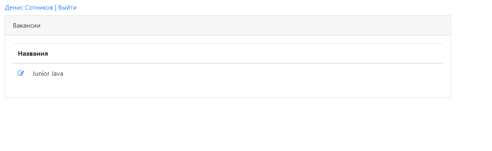

  
Technologies: 
 - servlets; 
 - JSP; 
 - simple HTML/JS(JQueue|Ajax)/CSS; 
 - JDBC; 
 - postgres SQL; 
 - apache Tomcat; 
 - mockito with PowerMock for test cases; 
 - OOP; 
 - maven as a build system. 
 
 
This application demonstrates a simple job placement and resume service for job search and candidate search 

Interface 

